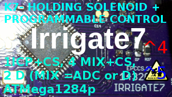
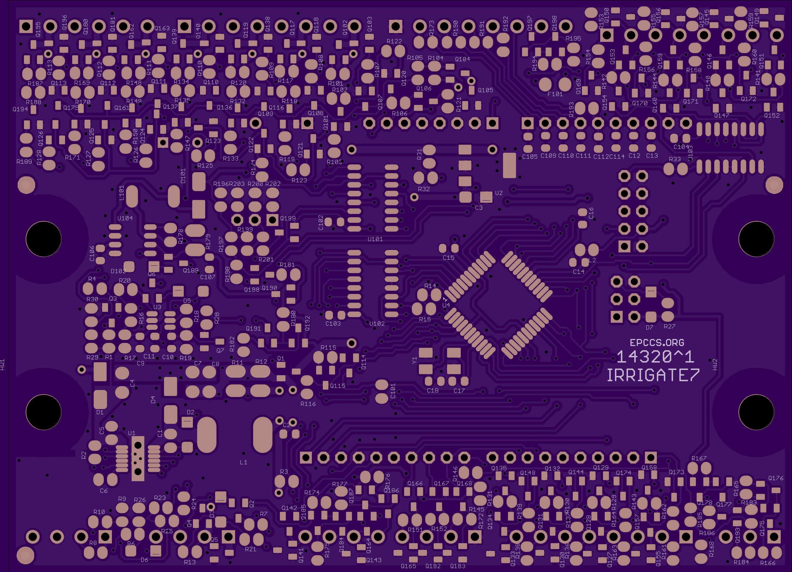
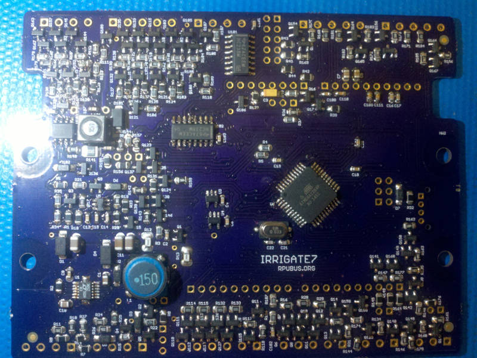
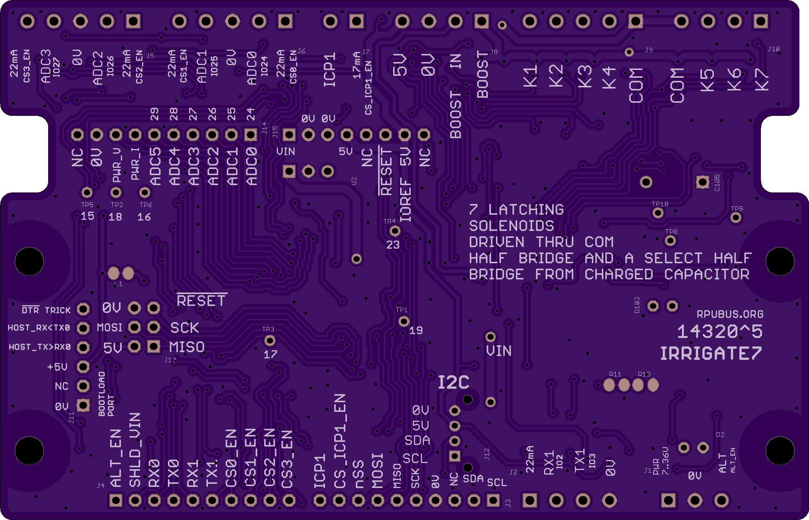
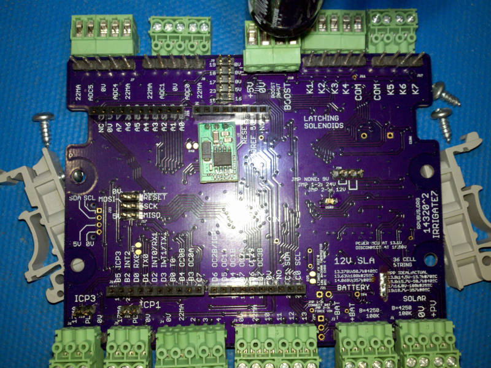
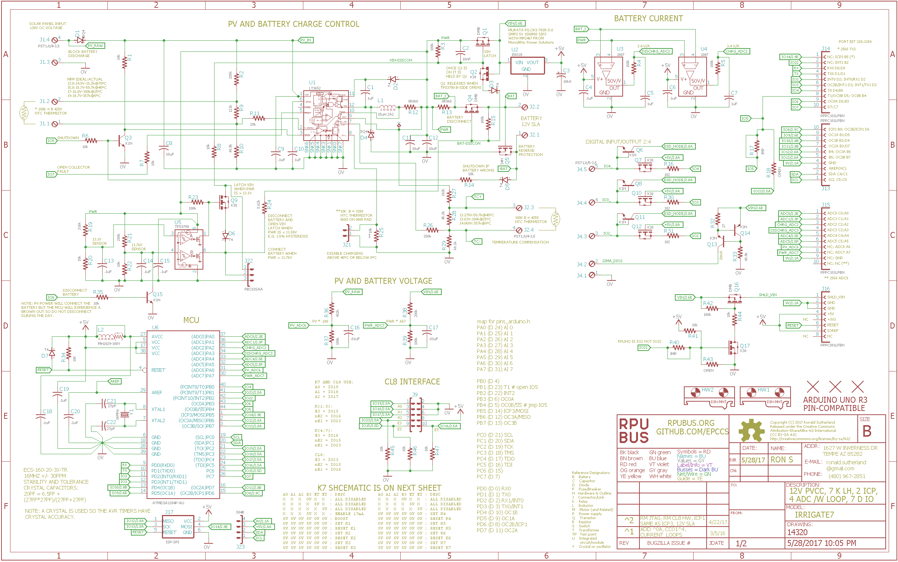
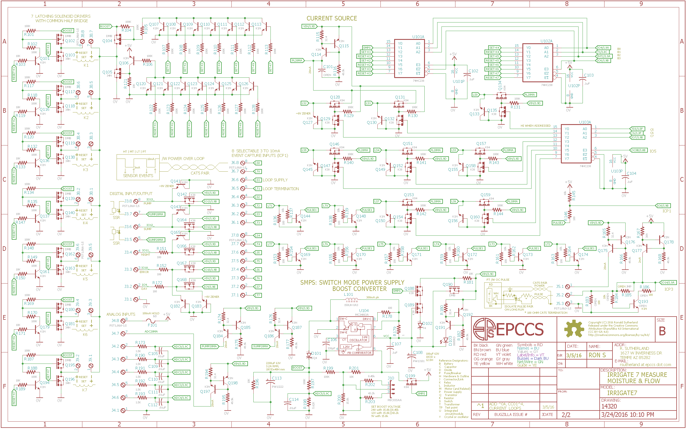

# Hardware

## Overview

ATmega1284P based controller board with options for DIN mounts and 3.5mm connections. Six digital I/O (2, 3, 24\*, 25\*, 26\*, 27\*) with level shift, the last four (\*) are also analog channels (0..3). Four 22mA current source for use with loop sensors are also available with enables (4, 5, 6, 7). One 17mA current source for the pulse sensor with enable (9). ICP1 is pulled down when enough current (>7mA) arrives from the pulse sensor. Alternat power input may be enabled (14), and power to the shield VIN pin may be disabled (22). Power with 7 thru 36V DC.

This Programmable Controller board has connections for seven Latching Solenoid Drivers
    
It is similar to an [RPUno] with integrated [K3] drivers. I plan to link a few to a Raspberry Pi with an [RPUpi] shield on one and the others will have an [RPUadpt] shield. The Raspberry Pi will host the toolchain which has an upload tool that can bootload firmware over the serial bus and push or pull firmware source from Github.

[RPUno]: https://github.com/epccs/RPUno
[RPUpi]: https://github.com/epccs/RPUpi
[K3]: https://github.com/epccs/Driver/tree/master/K3
[RPUadpt]: https://github.com/epccs/RPUadpt

Bootloader options include [optiboot] and [xboot]. 

[optiboot]: https://github.com/Optiboot/optiboot
[xboot]: https://github.com/alexforencich/xboot

## Inputs/Outputs/Functions

```
        ATmega1284p toolchain runs everywhere (Raspberry Pi, Desktop, Travis CI)
        Input/Outputs protected up to suppy voltage.
        ICP1 for pulse type flow meter.
        ICP1 current source.
        Four Analog or Digital channels (ADC0..ADC3).
        Four Currrent sources (CS0..CS3) for loop sensors.
        Power to the Shield Vin pin may be disabled (D 22).
        Two Digital I/O (have UART or INT option)
        Input power 7..36 VDC.
```

## Uses

```
        Flow Meter Data Acquisition using Capture Hardware.
        Latching/Holding (Pulse) Solenoids
        SHLD_VIN to the shield can be powered down while ATmega1284p continues to run.
```

## Notice

```
        AREF from ATmega1284p is not connected to the header.
        3V3 is not present on the board, the header pin is not connected.
        Alt power input is for small solar power (e.g. 1A max).
```


# Table Of Contents

1. [Status](#status)
2. [Design](#design)
3. [Bill of Materials](#bill-of-materials)
4. [Assembly](#assembly)
5. [How To Use](#how-to-use)


# Status



```
        ^5  Done: Design, Layout, BOM, Review*, Order Boards, Assembly,
            WIP: Testing,
            Todo: Evaluation.
            *during review the Design may change without changing the revision.
            remove LT3652 and all related parts
            add alternate power input and enalbe with digital TBD
            add level shift to ADC inputs (MIX)
            move nSS from D_5 to D_10 and use it for SPI 
            remove ICP3 input and use it for SPI
            remove D 12 and 13 and use for SPI
            use digital lines D 4..7 to control CS0..CS3
            use digital lines D 9 to control CS_ICP1

        ^4  Done: Design, Layout, BOM, Review*, Order Boards,
            WIP: halt (the LT3652 was found to be useless with a 12V system).
            Todo: Assembly, Testing, Evaluation.
```

Debugging and fixing problems i.e. [Schooling](./Schooling/)

Setup and methods used for [Evaluation](./Evaluation/)


# Design

The board is 0.063 thick, FR4, two layer, 1 oz copper with ENIG (gold) finish.






## Mounting

```
DIN rail
```

## Electrical Schematic





## Testing

Check correct assembly and function with [Testing](./Testing/)


# Bill of Materials

The BOM is a CVS file, import it into a spreadsheet program like LibreOffice Calc (or Excel), or use a text editor.

Option | BOM's included
----- | ----- 
A. | [BRD] 
M. | [BRD] [SMD] [HDR] 
W. | [BRD] [SMD] [HDR] [PLUG]
Z. | [BRD] [SMD] [HDR] [PLUG] [DIN]

[BRD]: ./Design/14320BRD,BOM.csv
[SMD]: ./Design/14320SMD,BOM.csv
[HDR]: ./Design/14320HDR,BOM.csv
[PLUG]: ./Design/14320PLUG,BOM.csv
[DIN]: ./Design/14320DIN,BOM.csv


# Assembly

## SMD

The board is assembled with CHIPQUIK no-clean solder SMD291AX (RoHS non-compliant). 

The SMD [Reflow] is done with a small IR oven.

[Reflow]: https://github.com/epccs/RPUno/tree/master/Reflow


# How To Use

This board is like an [RPUno] but has an ATmega1284p and Latching (or holding) solenoid drivers. The solenoid drivers are like [K3] but there are more of them. I have been running a K3 board with three latching valves controlled by an RPUno for over a year doing 10 cycles per day on each valve. 

[K3]: https://github.com/epccs/Driver/tree/master/K3
[RPUno]: https://github.com/epccs/RPUno/

Latching (or Holding) solenoids are widely available but they don't often say how to power them. I think it is because the idea of sending a current pulse to the coil is fairly complicated. Some coils will go up in smoke if the current flow is for to long. The pulse time is determined by the coil resistance and the size of capacitor discharged. Unfortunately, most manufacturers don't rate their products. So I sort of need to open the electronics up and see what they are doing. For example, the battery-operated controller for my valves has a 2200uF capacitor that is charged to about 20V. To test the coil I charge a capacitor of that size to 12V and see if it can latch it, and then 24V. The risk of damage to the coil increases with capacitor size and voltage, so I stay with 2200uF. It is probably worth trying to figure how reliable it latches at 12V but I used 24V on my setup. The board can software select 9V, 12V, or 24V.

If the solenoid driver bridge is shorted when the capacitor is discharged it will damage both the selected half bridge and the common half bridge. The bridge drives are tested with a 17mA current source that checks for a shorted bridge before powering the boost converter. The 17mA test current is sent through a LED which should flicker during normal operation, but if it stays on when the boost supply is enabled, then a half bridge has been damaged and the boost supply will not run until the failed parts are replaced. It is easy enough to find the short with a DMM, and reworking the SMD device should be possible, they are large SMD components (see the bill of materials for the parts I used). 

## Some Latching Things for consideration

* Push Actuator: Delta DSMS-0730-12, 12V@2.7A for 45mSec
* Power (440VAC@60A) Relay: TE EW60-1A3-BL12D04, 12V@125mA for 100mSec
* TBOS Latching Irrigation Solenoid: Rainbird TBOSPSOL, unknonw but probably 9V for 50mSec
* NODE Latching Irrigation Solenoid: Hunter 458200, 9V for 50mSec