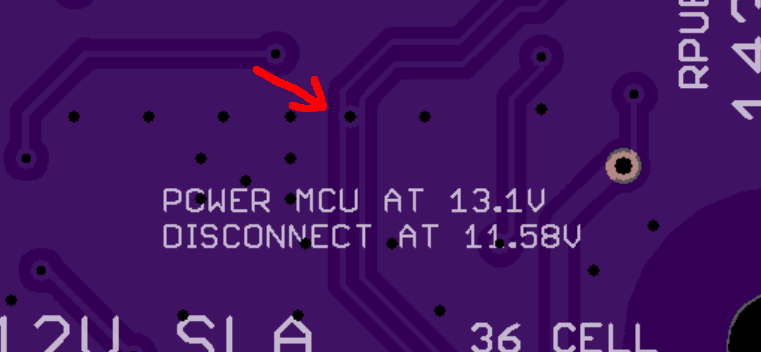
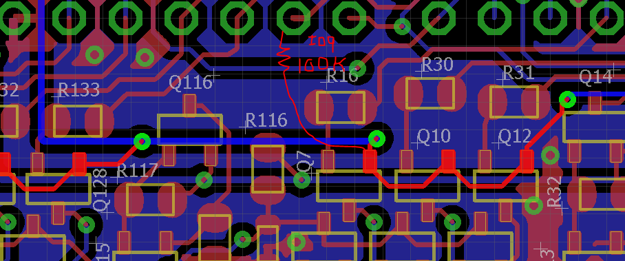
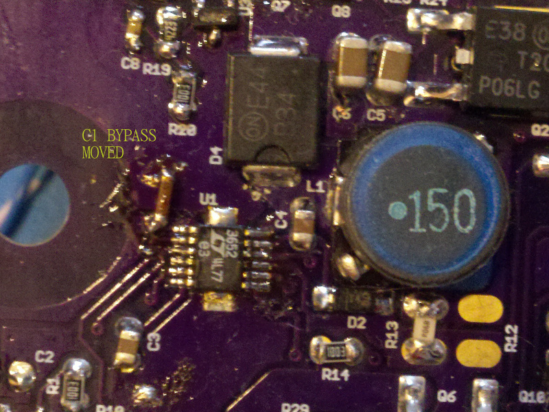
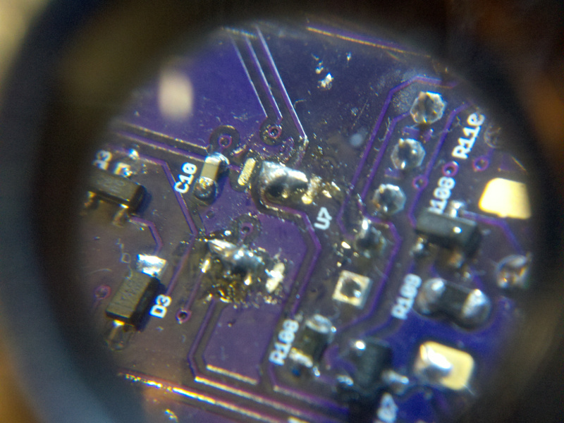
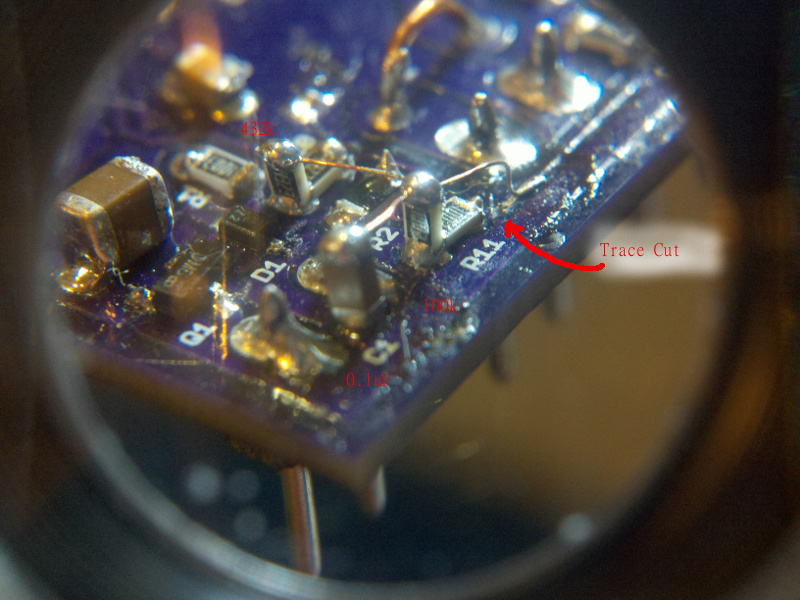
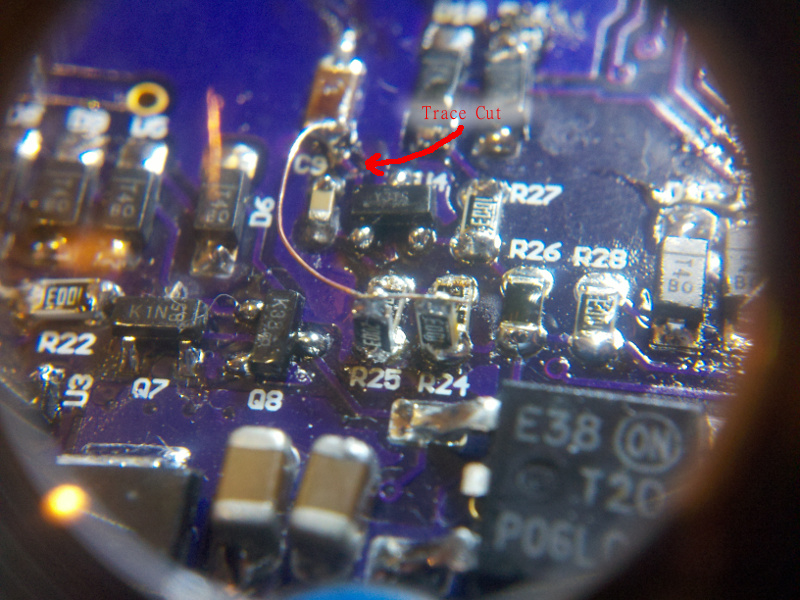
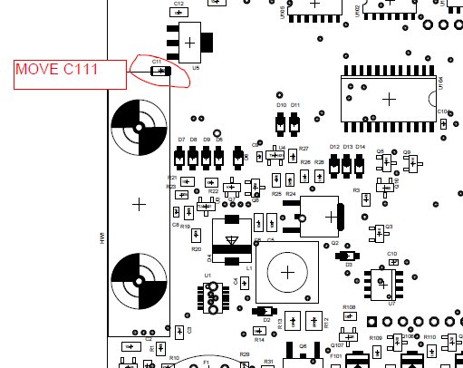

# Description

Some lessons I learned doing Irrigate7.

# Table Of Contents:

1. ^5 Local Variables 
1. ^4 ICP3 Remove
1. ^4 LT3652 Removed
1. ^3 Via on Wires
1. ^2 Digital IO Protection Resistor
1. ^2 Pull Up IO9
1. ^1 RPUno
1. ^1 CL8
1. ^1 K3
1. ^1 Digital IO Current Limit Resistor
1. ^0 C1 Bypass Moved to LT3652 VIN
1. ^0 LMV358 Does Not have 5V Befor Battery Connect
1. ^0 C11 Interference with HW1 (DIN mount)

## ^5 Local Variables 

I had some variables in the day_night stat machine default to auto. When I explicitly set them as static, the memory usage location changed (the .lst file shows that sort of info), that was all the evidence I needed to see.

Somehow I ran the day_night state machine for a few years without seeing that the timer had problems. I guess it was accidentally allocating the same memory location on the stack during each loop. That may seem unlikely, but I think that was what happened, it is an eye-opening possibility.

I may have other areas with this sort of problem.

## ^4 ICP3 Remove

ICP3 does not have a doubled buffered capture, so I can't use it to measure the duty cycle as I wanted for temperature and moisture sensors.  It makes more sense to use its alternate function (MOSI) for dedicated SPI to an SD card for data recording or to a Raspberry Pi for data acquisition (e.g., to acquire capture events and stream them directly to the SBC).

## ^4 LT3652 Remove

The MPPT LT3652 provides no usefulness when a 12V solar panel is used to charge a 12V battery. The PV panel MPP is at about 15V during summer temperature, so it is considerably more efficient to connect solar directly to the battery. Even when cold converting the solar voltage down to the battery voltage is now much more efficient (due to conversion loss).

After overhauling the RPUno and testing this summer, I am convinced that the P-CH controlled alternate power input is the way to go. The resulting power input is more flexible (takes 7..36VDC) and general-purpose.

## ^3 Via on Wires

How am I going to explain this to the boss? I even remember seeing the via while doing cleanup to the layout; something distracted me, I guess.

## ^2 Digital IO Protection Resistor

The level shifting NMOS will provide the protection resistor between 4.5V and 3.5V, and at 40mA the MCU pin voltage is over 0.5V, this all adds up to using a lower value protection resistor if it is 100 Ohms then at one of the NMOS extremes it will have 4.5V on one side and .5V on the other and thus a 4V drop, which means 40mA.

The reason I am looking at this is that both DIO13 and DIO12 are unable to sink all of a 22mA current source with the 182 Ohm resistor that is presently used as a protection resistor. Measurements indicate the NMOS side has about 3.7V and the MCU pin has 0.35V, which means the most it could ever sink is about 19mA (with 100 Ohm protection it should be able to sink about 32mA).

The life expectancy of the MCU pin is somewhat dependent on how much current it sinks, at 20mA it should last forever (e.g., >20 years), however at 40mA the life expectancy is short (perhaps a few weeks). 

## ^2 Pull Up IO9

Found Current sources only able to give a few mA during testing since IO9 is floating, add a pullup so it workes in a defined way after power-up.

## ^1 RPUno

[RPUno] went from ^2 to ^6, and the updates for RPUno are valid for the next version of Irrigate7.

[RPUno]: https://github.com/epccs/RPUno

## ^1 CL8 

The CL8 board was done based on Irrigate7^1's current loop sensors.

The current loop selection is going to be removed from the next version so that the ICP1 can be used as general-purpose sensor input, e.g., either a flow sensor or selectable pulse sensors (with the CL8 board).

Update: CL8 function will be done with [PWM] current sources.

[PWM]: https://github.com/epccs/Driver/tree/master/PWM

## ^1 K3 

The K3 board was done based on Irrigate7^1's solenoid drivers, and it has updates.

Update: The K3 updates were put back into Irrigate7^5.  

## ^1 Digital IO Current Limit Resistor 

Should go between K38 and MCU.

## ^0 C1 Bypass Moved to LT3652 VIN

Bypass does not work on the PV input like it seems to on CC01, so after some trial and error, I found it was needed at the LT3652 VIN pin. I thought for sure the 10uF was close enough, but it does not act like the 100nF bypass.

This move also got the LT3652 TIMER (C3) working better than I've seen, so I tried it on the CC01 board as well and the float time repeats now,  I think that is the general location to put it.

## ^0 LMV358 Does Not have 5V Befor Battery Connect

I checked that the charge control circuit was working before populating the MCU and other items but then found that the battery would not connect and U4 only had .65V on its reference input while PWR node had 6.25V. After some hair pulling it turned out the LMV358 positive rail has zero volts and prevents the TLVH431 from sensing the 6V level to connect. The first step is to remove Op-Amp*, then read up on the AVR ADC to see if resistor dividers can be made to work.

Removed the Op-Amp, added the resistor dividers to measure voltages. Also, add a decoupling capacitor, so the sample and hold capacitor has low impedance to read the value, and I can use a high resistance for the divider.

So that worked, the ADC can read the value and the power loss is low (it is also SMD art).

## ^0 C11 Interference with HW1 (DIN mount)

Layout error. 

