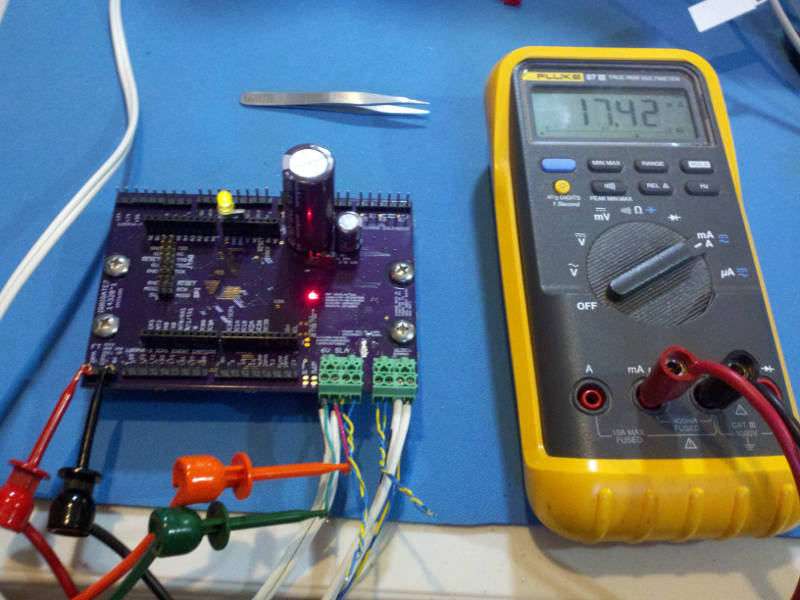
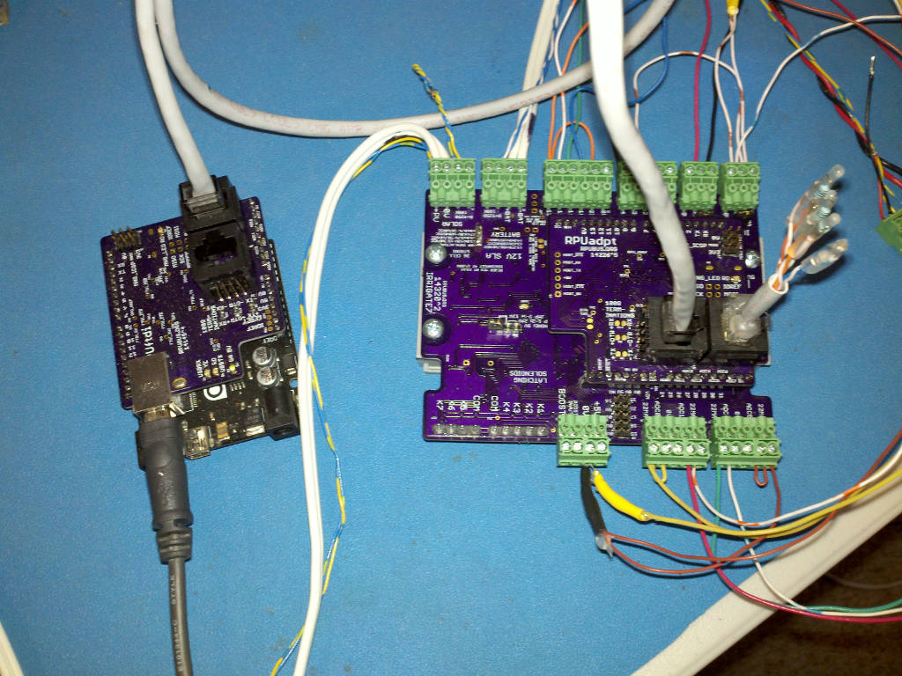
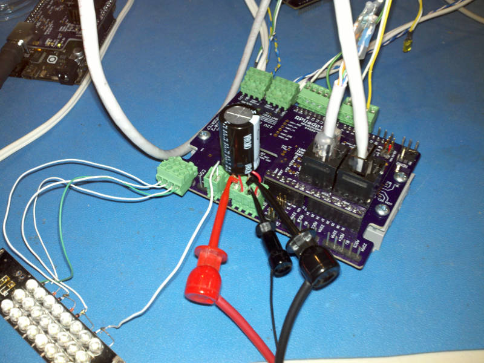

# Description

This is a list of Test preformed on each Irrigate7 after assembly.

# Table of References


# Table Of Contents:

1. [Basics](#basics)
2. [Assembly check](#assembly-check)
3. [IC Solder Test](#ic-solder-test)
4. [Reverse Battery Protection](#reverse-battery-protection)
5. [Battery Disconnect](#battery-disconnect)
6. [Power Protection](#power-protection)
7. [TPS3700 Window Comparator](#tps3700-window-comparator)
8. [LT3652 Power Up Without Battery](#lt3652-power-up-without-battery)
9. [LT3652 Load Test](#lt3652-load-test)
10. [Bias +5V](#bias-5v)
11. [K7 Bias 5V](#k7-bias-5v)
12. [20mA Source](#current-sources)
13. [Set MCU Fuse and Install Bootloader](#set-mcu-fuse-and-install-bootloader)
14. [Self Test](#self-test)


## Basics

These tests are for an assembled Irrigate7 board 14320^2 which may be referred to as a Unit Under Test (UUT). If the UUT fails and can be reworked then do so, otherwise it needs to be scraped. 

**Warning: never use a soldering iron to rework ceramic capacitors due to the thermal shock.**
    
Items used for test.




## Assembly check

After assembly check the circuit carefully to make sure all parts are soldered and correct, note that the device making is labeled on the schematic and assembly drawing.
    
NOTE: U2 is not yet on the board, so everything with +5V will not have power.


## IC Solder Test

The bottom pad on U1 dissipates heat as well as providing a ground, it is not connected to any other pin. The 0V plane is ground for this test. Check that a diode drop is present from each pin to the ground by measuring with a DMM's diode test between each pin and the 0V plane (reversed polarity). U1 pins 12, 10 and 9 are connected to L1 and R3 and read with a low (.13V) value. U2 not pop yet. U3 and U4 give a diode value on pins 1 and 5, while pins 3 and 4 are connected to R3 and L1 and read with a low value. U5 and U6 gives normal diode values where expected. U5 pin 2 and U6 pins 3, 5, 21 are connectd to ground and should have a short to 0V.


## Reverse Battery Protection

Apply a current limited (20mA) supply set with 14V to the +BAT and -BAT connector in reverse and verify that the voltage does not get through to TP4. Note some voltage (.2V) will be seen on TP4 because of how the shutdown through Q3 works.
    

## Battery Disconnect

Apply a current limited (20mA) supply set with 14V to the +BAT and -BAT connector and verify that voltage does not get through to TP4. 


## Power Protection

Apply a current limited (20mA) supply to the PV input with reverse polarity and ramp the voltage up to 30V, verify that no current flows.


## TPS3700 Window Comparator 

Connect 1k ohm between U2 pin 1 and pin 2 to give the VIN latch a load. Apply a current limited (30mA) supply starting at 12V to the +BAT and -BAT connector. Short J22 pin 2 and pin 3, then release the short, which will force the battery to connect. Check that PWR has been latched to the battery with TP4 and that the VIN latch has not set with U2 pin 1. Increase the supply slowly until VIN on U2 pin 1 has power, but no more than 14V. This is the voltage at which the load connects, and should be about 13.1V. Now slowly reduce the supply until the LED turns off. This is the voltage at which the battery disconnects and should be about 11.58V.

```
{ "LOAD_CONNNECT":[13.03,12.94,],
  "DISCONNECT":[11.47,11.40,] }
```


## LT3652 Power Up Without Battery

Connect 100 kOhm resistor to both the PV side and BAT side thermistor inputs to simulate room temperature. Connect an electronic load to the +BAT and -BAT. Connect 1k ohm between U2 pin 1 and pin 2 to give the VIN latch a load. Connect a current limited (50mA) supply to the +PV and -PV inputs turn it on and increase the voltage to about 14V. Verify no output. Next, increase the supply voltage to 21V and verify a regulated voltage (13.63V) between +BAT and -BAT* pins. 

NOTE: the LT3652 goes into fault when started into my HP6050A in CC mode, which is by design. I can start the LT3652 with the load off, or in CV mode and then switch to CC. This note is to remind me that it is an expected behavior.

```
{ "VIN@100K":[13.60,13.65,],
  "VIN@OPEN":[14.35,]}
```


## LT3652 Load Test

Connect 100 kOhm resistor to both the PV side and BAT side thermistor inputs to simulate room temperature. Connect an electronic load to the +BAT and -BAT. Connect 1k ohm between U2 pin 1 and pin 2 to give the VIN latch a small load. Set the electronic load voltage to 12.8V to simulate a battery. Connect +PV and -PV to a CC/CV mode supply with CC set at 50mA and  CV set at 0V. Apply power and increase the CV setting to 21V. Verify the solar power point voltage is about 16.9V, increase the supply current CC to 150mA and measure the power point voltage. Next increase the supply CC setting until its voltage increases to 21V, e.g. the supply changes from CC to CV mode, and check that the charge controller is current limiting at about 1.3A with 0R068 placed on R3, also check if U1 (LT3652) is getting hot. Note that the voltage at UUT is higher than at the load because the wires drop some voltage (the load is still running at the 12.8V). 

```
{ "PP100K@150mA&amp;12V8":[16.89,16.86,],
  "CURR_LIMIT":[1.33,1.30,] }
```


## Bias +5V

Apply a 30mA current limited 5V source to +5V (J10 pin 4 and pin 3). Check that the input current is for a blank MCU (e.g. less than 5mA). Turn off the power.

```
{ "I_IN_BLANKMCU_mA":[3.6,2.5,]}
```

Note if the fuse need set back to the factory (OEM) values there is a make rule, but VIN needs to be jumperd to +5V for the ICSP tool to work (the ESD_NODE needs bias for SCK on the tool to work).


## K7 Boost Bias 5V

Setup a current limited supply with 5V and about 30mA limit. Connect the supply to BOOST_IN (J10 pin 2) and 0V (J10 pin 3) to the supply. Measure the input current bias while disabled.

C106 (2200uF) is not on board, it is mounted in the plugable connector between BOOST (J10 pin 1) and 0V (J10 pin 3).

``` 
{"BOOST_DISABLED_mA":[0.2,0.01,] }
``` 


## Set MCU Fuse and Install Bootloader

Add U2 to the board now. Also jumper VIN on U2 pin 1 to +5V to bias the EDS_NODE. Apply a 60mA current limited 5V source to +5V (J10 pin 4 and pin 3). Measure the input current for referance (it takes time to settle, both 10mA ICP1 and ICP3 jumper is off).

```
{ "I_IN_BLANKMCU_WITH_U2_mA":[5.4,5.5,]}
```

Install Git and AVR toolchain on Ubuntu (16.04, on an old computer try https://wiki.ubuntu.com/Lubuntu). 

```
sudo apt-get install git gcc-avr binutils-avr gdb-avr avr-libc avrdude
```

Clone the Irrigat7 repository.

```
cd ~
git clone https://github.com/epccs/Irrigat7
cd ~/Irrigat7/Bootloader
```

Connect a 5V supply with CC mode set at 30mA to the +5V (J10 pin 4) and  0V (J10 pin 3). Connect the ICSP tool (J17). The MCU needs its fuses set, so run the Makefile rule to do that. 

```
make fuse
```

Next install the bootloader

```
make isp
```

Disconnect the ICSP tool and measure the input current, wait for the power to be settled. Turn off the power.

```
{ "I_IN_16MHZ_EXT_CRYST_mA":[]}
```


## Self Test

Items.



Plug an [RPUftdi] shield with [Host2Remote] firmware onto an [RPUno] board and load [I2C-Debug] on it.

[RPUftdi]: https://github.com/epccs/RPUftdi
[Host2Remote]: https://github.com/epccs/RPUftdi/tree/master/Host2Remote
[RPUno]: https://github.com/epccs/RPUno
[I2C-Debug]: https://github.com/epccs/RPUno/tree/master/i2c-debug

Use picocom to set the bootload address on the RPUftdi shield. The RPUftdi is at address 0x30 and the UUT will be at address 0x31.

```
picocom -b 38400 /dev/ttyUSB0
...
Terminal ready
/0/iaddr 41
{"address":"0x29"}
/0/ibuff 3,49
{"txBuffer":[{"data":"0x3"},{"data":"0x31"}]}
/0/iread? 2
{"rxBuffer":[{"data":"0x3"},{"data":"0x31"}]}
```

Exit picocom (Cntl^a and Cntl^x). Plug an [RPUadpt] shield with [Remote] firmware onto the UUT board. Note the RPUadpt address defaults to 0x31 when its firmware was installed.

[RPUadpt]: https://github.com/epccs/RPUadpt
[Remote]: https://github.com/epccs/RPUadpt/tree/master/Remote

Connect ICP1 (J8) jumper. Connect the Self Test [Harness] to the UUT. Connect 100 kOhm resistor to both the PV side and BAT side thermistor inputs to simulate room temperature. Connect a 12V SLA battery to the +BAT and -BAT. Connect +PV and -PV to a CC/CV mode supply with CC set at 150mA and  CV set at 0V. Apply power and increase the CV setting to 21V.

[Harness]: https://raw.githubusercontent.com/epccs/RPUno/master/SelfTest/Setup/SelfTestWiring.png

Once the UUT connects power (battery charged to > 13.1V) check that the VIN pin on the shield has power (this is not tested by the self-test so it has to be done manually).

Measure the +5V supply at J7 pin 6 and pin 5.

```
{ "+5V":[4.9959,4.9612,] }
```

Edit the SelfTest main.c such that "#define REF_EXTERN_AVCC 4995900UL" has the correct value for the UUT. Next, run the bootload rule in the Makefile to upload the self-test firmware to the UUT that the remote shield is mounted on.

```
cd ~Irrigate7/SelfTest
gedit main.c
make bootload
# toss the change (if you want)
git checkout -- main.c
```

Use picocom to see the SelfTest results over its UART interface.


```
rsutherland@conversion:~/Irrigate7/SelfTest$ picocom -b 38400 /dev/ttyUSB0
picocom v1.7

port is        : /dev/ttyUSB0
flowcontrol    : none
baudrate is    : 38400
parity is      : none
databits are   : 8
escape is      : C-a
local echo is  : no
noinit is      : no
noreset is     : no
nolock is      : no
send_cmd is    : sz -vv
receive_cmd is : rz -vv
imap is        : 
omap is        : 
emap is        : crcrlf,delbs,

Terminal ready
Irrigate7 DIO and ADC Self Test date: Jun 25 2017
I2C provided address 0x31 from RPU bus manager
+5V needs measured and then set as REF_EXTERN_AVCC: 4.996 V
Charging with CURR_SOUR_EN==low: 0.040 A
PWR (Battery) at: 13.275 V
MPPT at: 16.897 V
ADC0 at: 0.000 V
ADC1 at: 0.000 V
ADC4 at: 0.000 V
ADC5 at: 0.000 V
ICP1 /w 0mA on plug termination reads: 1
ICP3 /w 0mA on plug termination reads: 1
CC_nFAULT measured with a weak pull-up: 1
22MA@DIO10 curr source on R1: 0.021 A
22MA@DIO2 curr source on R2: 0.021 A
Dischrg with CURR_SOUR_EN==high: 0.046 A
Chrg delta with CURR_SOUR_EN==high: 0.086 A
22MA@ADC0 on R1: 0.022 A
22MA@ADC5 on R2: 0.022 A
10MA@ICP1 with ICP1 PL input: 0.010 A
ICP1 /w 10mA on plug termination reads: 0
10MA@ICP3 with ICP3 PL input: 0.010 A
ICP3 /w 10mA on plug termination reads: 0
Dischrging with CC_SHUTDOWN==high : 0.141 A
PV open circuit (LT3652 off) at: 20.972 V
22mA@ADC0 and 22mA@ADC1 on R1: 0.044 A
22MA@DIO10, 22mA@ADC0, 22mA@ADC1 on R1: 0.065 A
22mA@ADC4 and 22mA@ADC5 on R2: 0.043 A
22MA@DIO2, 22mA@ADC4, 22mA@ADC5 on R2: 0.065 A
ICP1 10mA + 17mA curr source on ICP1_TERM: 0.028 A
ICP1 10mA with DIO4 sinking 17mA: 0.010 A
ICP1 10mA with DIO3 sinking 17mA: 0.010 A
ICP3 10mA + 17mA curr source on ICP3_TERM: 0.028 A
ICP1 10mA with DIO4 sinking 17mA: 0.010 A
Dischrg /w CC_SHUTDOWN, !K3_E3, !CURR_SOUR_EN: 0.046 A
Dischrg@100mSec /w CC_SHUTDOWN, K3_E3, !CURR_SOUR_EN: 0.050 A
Dischrg@300mSec /w CC_SHUTDOWN==high, K3_E3==hight: 0.118 A
Dischrg@500mSec /w CC_SHUTDOWN==high, K3_E3==hight: 0.123 A
Dischrg@2000mSec /w CC_SHUTDOWN==high, K3_E3==hight: 0.069 A
BOOST@2000mSec: 24.110 V
To disconnect battery turn off the PV supply and LED should stop blinking
[PASS]
```

Before truning off the PV power check that the VIN pin on the shield has no power, the test turns it off. Then turn off the power supply and verify battery was disconnected.

Run the SelfTest for each of the three voltage settings and measure the value with a DMM.

```
{ "9VBOOSTLD_V":[9.2,9.1,],
"12VBOOST_V":[12.2,12.1,],
"24VBOOST_V":[24.1,24.1,]}
```

## Solenoid Test

Items.



Connect the [Solenoid Test Harness] to the UUT. Connect 100 kOhm resistor to both the PV side and BAT side thermistor inputs to simulate room temperature. Connect a 12V SLA battery to the +BAT and -BAT. Connect +PV and -PV to a CC/CV mode supply with CC set at 150mA and  CV set at 0V. Apply power and increase the CV setting to 21V.

[Solenoid Test Harness]: https://raw.githubusercontent.com/epccs/RPUno/master/SelfTest/Setup/SelfTestWiring.png


```
cd ~Irrigate7/Solenoid
make bootload
```

Use picocom to see the Solenoid initialization on the [Solenoid Test Harness] LED's

```
rsutherland@conversion:~/Irrigate7/Solenoid$ picocom -b 38400 /dev/ttyUSB0
picocom v1.7
```
