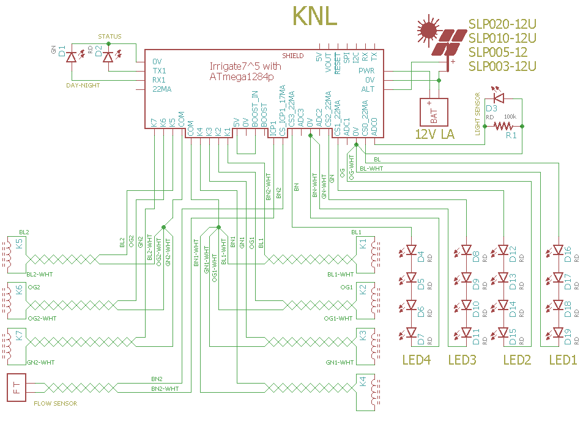

# Solenoid and Night Light combined


## known bugs

See [Solenoid] and [NightLight].

If the sun is up when the MCU is reset or at power up then alternate power is not enabled until the next day. The workaround is to run the /alt command that will enable alternate power.


## Overview

This combines [Solenoid] and [NightLight] functions.


## Wiring

``` 
ATmega328p Board       function
-----------------------------------------
PC3        RX1         DAY-NIGHT STATUS LED
PB5        TX1         STATUS LED
PC2        ADC0        LIGHT SENSOR PV
PB0        ICP1        FLOW SENSOR
PD7        CS_ICP1_EN  FLOW SENSOR PWR
PD5        CS0_EN      LED STRING 1
PD6        CS1_EN      LED STRING 2
PD3        CS2_EN      LED STRING 3
PD4        CS3_EN      LED STRING 4
PC2..5     K1          SOLENOID 1
PC2..5     K2          SOLENOID 2
PC2..5     K3          SOLENOID 3
PC2..5     K4          SOLENOID 4
PC2..5     K5          SOLENOID 5
PC2..5     K6          SOLENOID 6
PC2..5     K7          SOLENOID 7
``` 




The STATUS_LED blinks on and off for a second when an rpu_address is read over I2C (if I2C failed it blinks four times as fast). 


# EEPROM Memory map 

A map of the solenoid settings in EEPROM. 

```
                                        K1   K2   K3   K4   K5   K6   K7
function                    type        ee_addr
Solenoid::id                UINT16      40   60   80   100  120  140  160
Solenoid::delay_start_sec   UINT32      42   62   82   102  122  142  162
Solenoid::runtime_sec       UINT32      46   66   86   106  126  146  166
Solenoid::delay_sec         UINT32      50   70   90   110  130  150  170
Solenoid::flow_stop         UINT32      54   74   94   114  134  154  174
Solenoid::cycles            UINT8       58   78   98   118  138  158  178
```

A map of the LED timer settings in EEPROM. 

```
function            type    ee_addr:L1   L2   L3   L4
id                  UINT16          200  220  240  260
delay_start_sec     UINT32          202  222  242  262
runtime_sec         UINT32          206  226  246  266
delay_sec           UINT32          210  230  250  270
mahr_stop           UINT32          214  234  254  274
cycles              UINT16          218  238  258  278
```


# Start of Day 

The [day-night] state machine is used to load and run [Solenoid] EEPROM values after the morning debounce. The each valve will start to cycle after its delay_start time has elapsed.

[day-night]: ../DayNight
[Solenoid]: ../Solenoid

# Start of Night

The [day-night] state machine is used to load and run [NightLight] EEPROM values to operate LED's after the evening debounce. The LED timers work like the Solenoid timers except mAHr_stop replaces flow_stop (it will stop the LED once that much current has been used from the battery). The LED's do not have a resource constraint like the Flow Meter, so all the LED's can operate at once.

[NightLight]: ../NightLight


# Flow Sensor

ICP1 is available to the solenoid control and live [Capture] commands are available over serial. The differance in capture counts (between the valve set and reset time) is accumulated and held as the flow count for each zone, its value is can be reported with the [Solenoid] /flow? command.

[Capture]: ../Capture
[Solenoid]: ../Solenoid

At present, the flow rate is not held but live capture data can be used to determine the flow rate when a valve is set. The flow meter is not treated as a calibrated device by the AVR it is up to the higher level system to convert flow pulse counts into volumes. One of the goals for [RPUipc] is to provide hardware that can be used for flow meter calibration.

[RPUipc]: https://github.com/epccs/RPUicp/


# Firmware Upload

With a serial port connection (set the BOOT_PORT in Makefile) and optiboot installed on the RPUno run 'make bootload' and it should compile and then flash the MCU.

``` 
sudo apt-get install git gcc-avr binutils-avr gdb-avr avr-libc avrdude
git clone https://github.com/epccs/Irrigate7/
cd /Irrigate7/KNL
make bootload
...
AVR Memory Usage
----------------
Device: atmega1284p

Program:   35164 bytes (26.8% Full)
(.text + .data + .bootloader)

Data:       1514 bytes (9.2% Full)
(.data + .bss + .noinit)
...
avrdude done.  Thank you.
``` 

Now connect with picocom (or ilk).

``` 
#exit is C-a, C-x
picocom -b 38400 /dev/ttyUSB0
``` 


# Commands

Commands are interactive over the serial interface at 38400 baud rate. The echo will start after the second character of a new line. 


## /\[rpu_address\]/\[command \[arg\]\]

rpu_address is taken from the I2C address 0x29 (e.g. ../Uart/id.h get_Rpu_address() ). The value of rpu_address is used as a character in a string, which means don't use a null value (C strings are null terminated), but the ASCII value for '1' (0x31) is easy and looks nice, though I fear it will cause some confusion when it is discovered that the actual address value is 49.

The STATUS_LED is bliked fast (twice per second) if the I2C address is not found, also the rpu_address defaults to '0'. 

Commands and their arguments follow.


## /0/id? \[name|desc|avr-gcc\]

Identify is from ../Uart/id.h Id().

``` 
/1/id?
{"id":{"name":"KNL","desc":"Irrigate7 (14320^5) Board /w atmega1284p","avr-gcc":"5.4.0"}}
```


## [/0/krun k\[,cycles\]](../Solenoid#0krunkcycles)  


## [/0/ksave k,cycles](../Solenoid#0ksavekcycles) 


## [/0/kload k](../Solenoid#0kloadk) 


## [/0/kstop k](../Solenoid#0kstopk) 


## [/0/kpre k,delay_start_in_sec](../Solenoid#0kprekdelaystartinsec)


## [/0/krunt k,runtime_in_sec](../Solenoid#0kruntkruntimeinsec)


## [/0/kdelay k,delay_in_sec](../Solenoid#0kdelaykdelayinsec)


## [/0/kfstop k,flow_stop](../Solenoid#0kfstopkflowstop)


## [/0/kflow? k](../Solenoid#0kflowk)


## [/0/ktime? k](../Solenoid#0ktimek)


## [/0/runled led\[,cycles\]](../NightLight#0runledledcycles) 


## [/0/stopled led](../NightLight#0stopledled)


## [/0/preled led,delay_start_in_sec](../NightLight#0preledleddelaystartinsec)


## [/0/runtimeled led,runtime_in_sec](../NightLight#0runtimeledledruntimeinsec)


## [/0/delayled led,delay_in_sec](../NightLight#0delayledleddelayinsec)


## [/0/mahrled led,mAHr](../NightLight#0mahrledledmahr)


## [/0/savled led,cycles](../NightLight#0saveledledcycles)


## [/0/loadled led](../NightLight#0loadledled)


## [/0/led? led](../NightLight#0ledled)


## [/0/analog? 0..7\[,0..7\[,0..7\[,0..7\[,0..7\]\]\]\]](../Adc#0analog-0707070707)


## [/0/iscan?](../i2c-debug#0iscan)


## [/0/iaddr 0..127](../i2c-debug#0iaddr-0127)


## [/0/ibuff 0..255\[,0..255\[,0..255\[,0..255\[,0..255\]\]\]\]](../i2c-debug#0ibuff-02550255025502550255)


## [/0/ibuff?](../i2c-debug#0ibuff)


## [/0/iwrite](../i2c-debug#0iwrite)


## [/0/iread?](../i2c-debug#0iread)


## [/0/day?](../DayNight#0day)


## [/0/charge?](../AmpHr#0charge)


## [/0/alt](../Alternat#0alt)


## [/0/altcnt?](../Alternat#0altcnt)


## [/0/initICP icp1,mode,prescale](../Capture#0initicp-icp1modeprescale)


## [/0/count? \[icp1\]](../Capture#0count-icp1)


## [/0/capture? \[icp1,1..15\]](../Capture#0capture-icp1115)


## [/0/event? \[icp1,1..31\]](../Capture#0event-icp1131)
