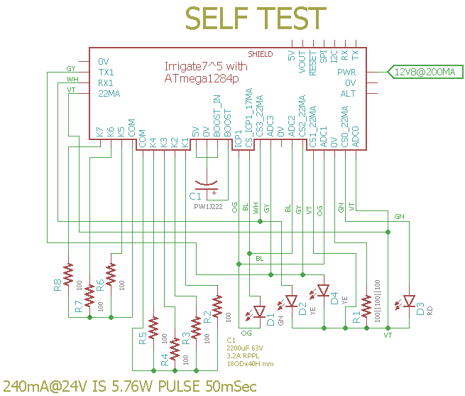

# Self-Test

## Overview

Check Irrigate7 Board Functions, runs once after a reset and then loops in a do noting section.

For a quick idea of what is going on lets look at R1 (47 Ohm) which has three 20mA current sources (22mA@DIO10, 22mA@ADC1, 22mA@ADC0) feeding into it, and is measured with ADC0. The 22mA@DIO10 digital current source connects to DIO13 befor going through a string of red LED that feed into the R1 resistor. When DIO13 sinks the current its voltage will be about 4V at the plug which should not bias the LED's.

Note: I am concerned the level shift could somewhat turn on with the 4V drop on the DIO protection resistor and that would cause problems.

The red and green LED are used to indicate test status.

## Wiring Needed for SelfTest



## Battery

Connect a fairly large 12V SLA battery and a 100k Ohm resistor to the battery thermistor input. The test looks for an MPPT voltage so the battery should be less than the float voltage. 

The battery needs to charge to 13.1V before the VIN that powers MCU will connect. A large battery will give sufficient time to load the firmware and run a test before the float voltage is reached and the MPPT mode terminates.

## Power Supply

Connect a power supply with CV and CC mode. Set CC at 150mA then increase CV to 21V. The charge controler will turn on and regulate the input voltage at its MPPT (assuming the battery is not at its float voltage). 

Note: I adjust CC to speed up charging until VIN connects and then return it to the 150mA setting.

## Firmware Upload

With a serial port connection (set the BOOT_PORT in Makefile) and xboot installed on the Irrigate7 run 'make bootload' and it should compile and then flash the MCU.

``` 
rsutherland@conversion:~/Samba/Irrigate7/SelfTest$ make bootload
...
avrdude done.  Thank you.
rsutherland@conversion:~/Samba/Irrigate7/SelfTest$ make clean
rm -f SelfTest.hex SelfTest.map
``` 

Now connect with picocom (exit is C-a, C-x). 

```
rsutherland@conversion:~/Samba/Irrigate7/SelfTest$ picocom -b 38400 /dev/ttyUSB0
picocom v1.7

port is        : /dev/ttyUSB0
flowcontrol    : none
baudrate is    : 38400
parity is      : none
databits are   : 8
escape is      : C-a
local echo is  : no
noinit is      : no
noreset is     : no
nolock is      : no
send_cmd is    : sz -vv
receive_cmd is : rz -vv
imap is        : 
omap is        : 
emap is        : crcrlf,delbs,

Terminal ready
Irrigate7 DIO and ADC Self Test date: Jun 25 2017
I2C provided address 0x31 from RPU bus manager
+5V needs measured and then set as REF_EXTERN_AVCC: 4.996 V
Charging with CURR_SOUR_EN==low: 0.040 A
PWR (Battery) at: 13.275 V
MPPT at: 16.897 V
ADC0 at: 0.000 V
ADC1 at: 0.000 V
ADC4 at: 0.000 V
ADC5 at: 0.000 V
ICP1 /w 0mA on plug termination reads: 1
ICP3 /w 0mA on plug termination reads: 1
CC_nFAULT measured with a weak pull-up: 1
22MA@DIO10 curr source on R1: 0.021 A
22MA@DIO2 curr source on R2: 0.021 A
Dischrg with CURR_SOUR_EN==high: 0.046 A
Chrg delta with CURR_SOUR_EN==high: 0.086 A
22MA@ADC0 on R1: 0.022 A
22MA@ADC5 on R2: 0.022 A
10MA@ICP1 with ICP1 PL input: 0.010 A
ICP1 /w 10mA on plug termination reads: 0
10MA@ICP3 with ICP3 PL input: 0.010 A
ICP3 /w 10mA on plug termination reads: 0
Dischrging with CC_SHUTDOWN==high : 0.141 A
PV open circuit (LT3652 off) at: 20.972 V
22mA@ADC0 and 22mA@ADC1 on R1: 0.044 A
22MA@DIO10, 22mA@ADC0, 22mA@ADC1 on R1: 0.065 A
22mA@ADC4 and 22mA@ADC5 on R2: 0.043 A
22MA@DIO2, 22mA@ADC4, 22mA@ADC5 on R2: 0.065 A
ICP1 10mA + 17mA curr source on ICP1_TERM: 0.028 A
ICP1 10mA with DIO4 sinking 17mA: 0.010 A
ICP1 10mA with DIO3 sinking 17mA: 0.010 A
ICP3 10mA + 17mA curr source on ICP3_TERM: 0.028 A
ICP1 10mA with DIO4 sinking 17mA: 0.010 A
Dischrg /w CC_SHUTDOWN, !K3_E3, !CURR_SOUR_EN: 0.046 A
Dischrg@100mSec /w CC_SHUTDOWN, K3_E3, !CURR_SOUR_EN: 0.050 A
Dischrg@300mSec /w CC_SHUTDOWN==high, K3_E3==hight: 0.118 A
Dischrg@500mSec /w CC_SHUTDOWN==high, K3_E3==hight: 0.123 A
Dischrg@2000mSec /w CC_SHUTDOWN==high, K3_E3==hight: 0.069 A
BOOST@2000mSec: 24.110 V
To disconnect battery turn off the PV supply and LED should stop blinking
[PASS]


Only open the ESD shield bag in an ESD safe area.
Remove the shipping box and this paper from the area 
before opening the ESD shield bag. 
``` 
