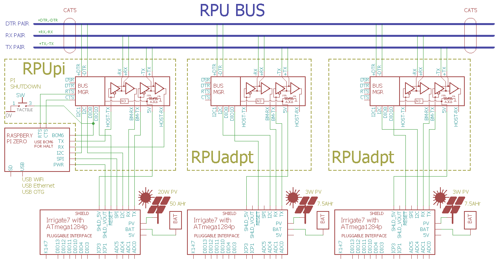

# Irrigate7 

From <https://github.com/epccs/Irrigate7/>

## Overview

This Controller board is based on an ATmega1284p and is programable with the open source GCC toolchain for AVR. It has pluggable connections for seven Latching Solenoid Drivers, Input Capture, and four Analog inputs with current sources. Power with 7 thru 36V DC.

It is similar to the [RPUno] but has integrated K7 (which is a scaled up [K3]). It's MCU is connected to headers that work with the [RPUpi], [RPUftdi], or [RPUadpt] shields.

[K3]: https://github.com/epccs/Driver/tree/master/K3
[RPUno]: https://github.com/epccs/RPUno
[RPUpi]: https://github.com/epccs/RPUpi
[RPUftdi]: https://github.com/epccs/RPUftdi
[RPUadpt]: https://github.com/epccs/RPUadpt

[Forum](http://rpubus.org/bb/viewforum.php?f=17)

[HackaDay](https://hackaday.io/project/25599-irrigate7-a-solar-powered-atmega1284p-board)

## Status


## [Hardware](./Hardware)

Hardware files include schematic, bill of materials, and various notes for testing and evaluation. The [Eagle] files are kept in a different location.

[Eagle]: https://github.com/epccs/Eagle/tree/master/Irrigate7

## Example with RPU BUS (RS-422)

A serial bus that allows multiple microcontroller boards to be connected to a host computer serial port. An [RPUpi] shield has a connector for a Pi Zero to act as the host computer, and connect to other boards with a [RPUadpt] shield over a daisy-chain of CAT5 cables. 



The host computer is able to use it's RS-232 serial port and programs (e.g. avrdude, PySerial, picocom...) when communicating with the ATmega1284p. These programs don't need to known how to control the differential transceivers as would normally be necessary. In part because RS-422 is full duplex like RS-232, but also the transceivers are activated only when a UART line is low (e.g. somewhat like I2C).  


## AVR toolchain

The core files for this board are in the /lib folder. Each example has its files and a Makefile in its own folder. The toolchain is available as standard packages on Ubuntu, Raspbian, Windows 10 (with [WSL] installed), and probably Mac (I do not have a Mac). 

[WSL]: https://docs.microsoft.com/en-us/windows/wsl/install-win10

```
sudo apt-get install git make gcc-avr binutils-avr gdb-avr avr-libc avrdude
git clone https://github.com/epccs/Irrigate7
cd Irrigate7/Adc
make [bootload]
```

* [gcc-avr](http://packages.ubuntu.com/search?keywords=gcc-avr)
* [binutils-avr](http://packages.ubuntu.com/search?keywords=binutils-avr)
* [gdb-avr](http://packages.ubuntu.com/search?keywords=gdb-avr)
* [avr-libc](http://packages.ubuntu.com/search?keywords=avr-libc)
* [avrdude](http://packages.ubuntu.com/search?keywords=avrdude)

The software is a guide, it is in C because that is what works for me. The toolchain has been marvelous, but your mileage may vary. I have had issues with ISP tools but found that an Arduino Uno loaded with the ArduinoISP example sketch provided in the IDE has worked reliably for placing the bootloader. 
